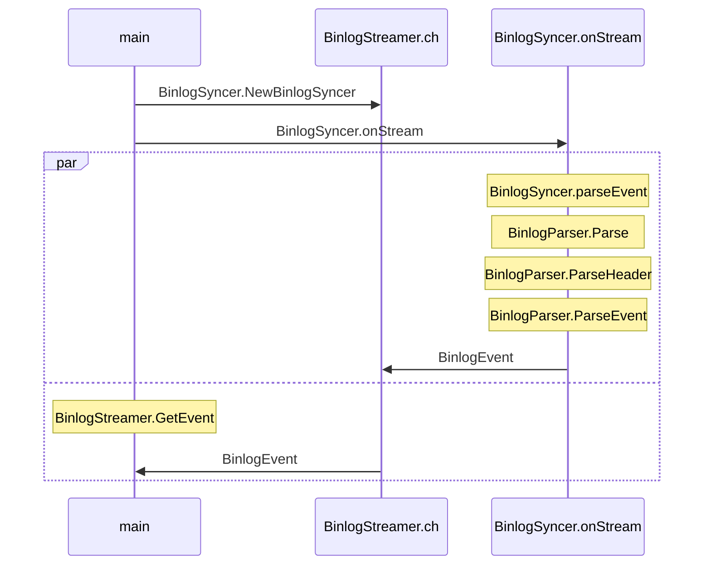

# go-mysql-example
## TableMapEvent

BinlogSyncer.NewBinlogSyncer

BinlogSyncer.StartSync
BinlogSyncer.startDumpStream
ㄴ BinlogSyncer.onStream 

BinlogStreamer.GetEvent

BinlogSyncer.parseEvent
BinlogParser.Parse

