# go-mysql-example
[go-mysql](https://github.com/go-mysql-org/go-mysql)의 deserialize(binaray->객체)를 테스트할 때 필요한 binary를 생성해주는 코드입니다.
go-mysql과 연결된 mysql에 쿼리를 실행시키면 상응하는 이벤트가 binary 형태로 dump됩니다.

## TableMapEvent

```mermaid
sequenceDiagram
    main ->> BinlogStreamer.ch: BinlogSyncer.NewBinlogSyncer
    main ->> BinlogSyncer.onStream: BinlogSyncer.onStream
    par
        note over BinlogSyncer.onStream: BinlogSyncer.parseEvent
        note over BinlogSyncer.onStream: BinlogParser.Parse
        note over BinlogSyncer.onStream: BinlogParser.ParseHeader
        note over BinlogSyncer.onStream: BinlogParser.ParseEvent
        BinlogSyncer.onStream ->> BinlogStreamer.ch: BinlogEvent 
    and
        note over main: BinlogStreamer.GetEvent
        BinlogStreamer.ch ->> main: BinlogEvent
    end
```

BinlogSyncer.NewBinlogSyncer

BinlogSyncer.StartSync
BinlogSyncer.startDumpStream
ㄴ BinlogSyncer.onStream 

BinlogStreamer.GetEvent

BinlogSyncer.parseEvent
BinlogParser.Parse

